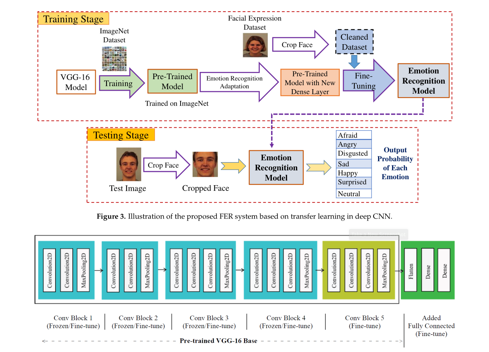

# FER_TL_DCNN

This repository is the implementation of this paper - [Facial Emotion Recognition Using Transfer Learning in the Deep CNN](https://www.mdpi.com/2079-9292/10/9/1036) - using python programming language and tensorflow library.

## Authors

Paper authors:  
* M. A. H. Akhand
* Shuvendu Roy
* Nazmul Siddique
* Md Abdus Samad Kamal
* Tetsuya Shimamura  

Codebase authors:
* Milad Sadeghi DM [@EverLookNeverSee](https://github.com/EverLookNeverSee)
